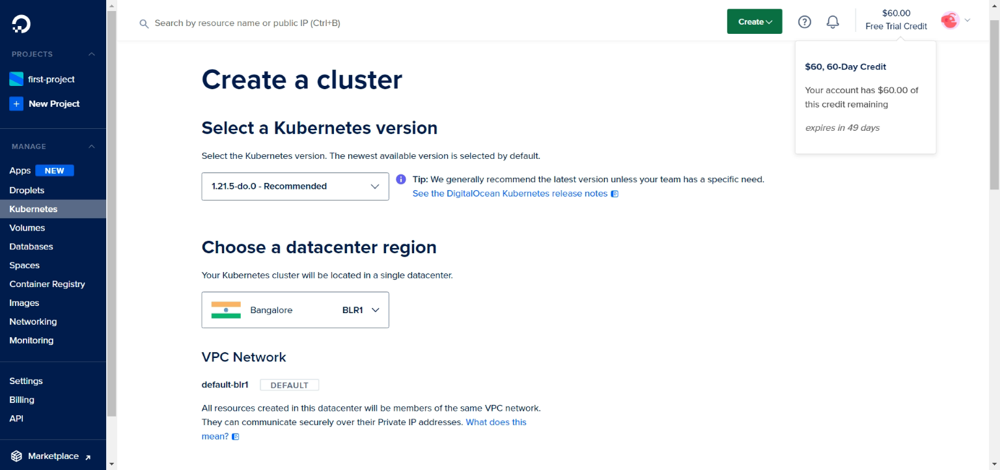
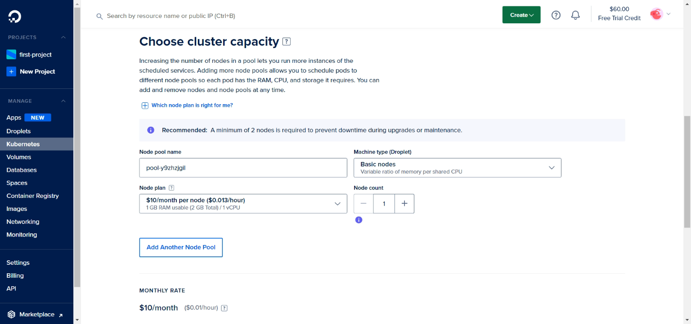
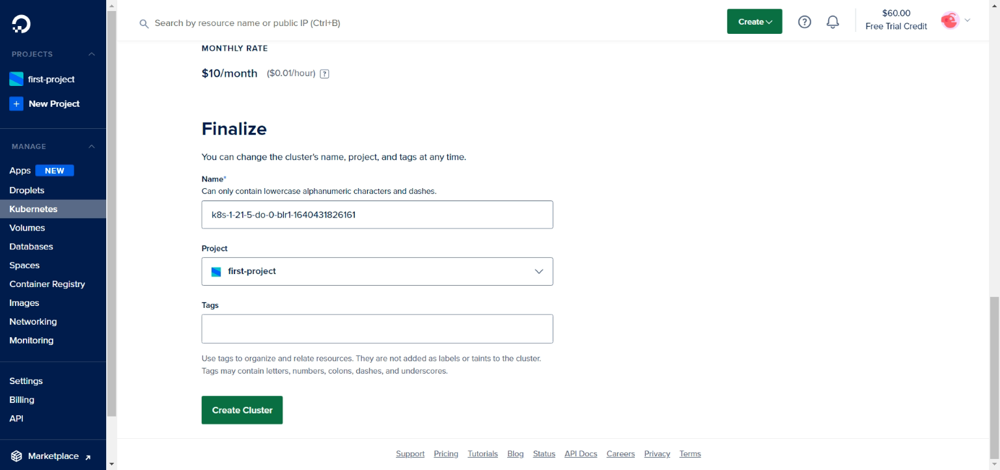
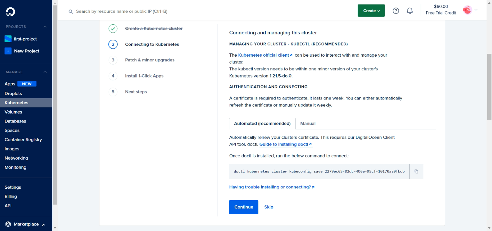
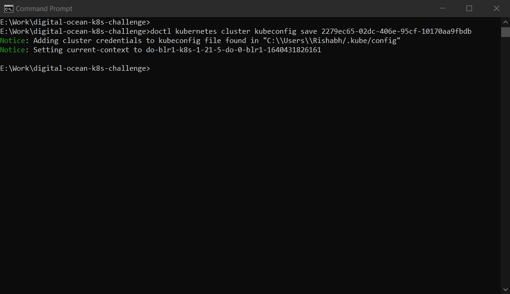
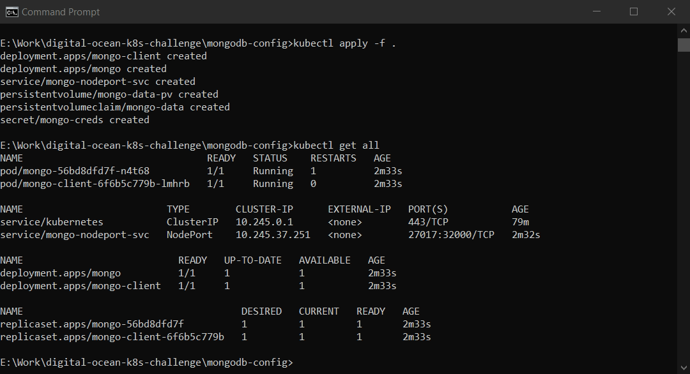
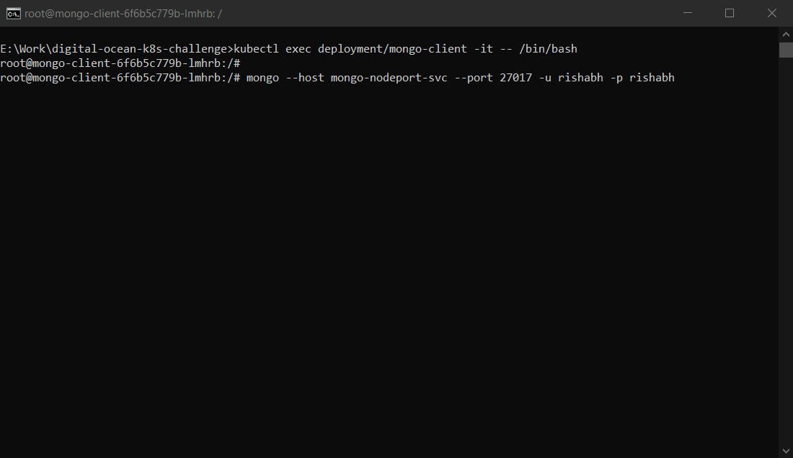
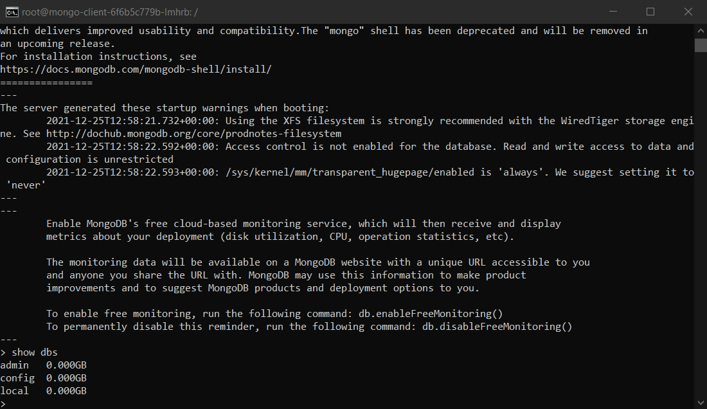

# DigitalOcean Kubernetes Challenge

## Deploy scalable NoSQL database (MongoDB) cluster

### Step 0: Prerequisites:

- [DigitalOcean account](https://www.digitalocean.com/?refcode=6ed125d9264d&utm_campaign=Referral_Invite&utm_medium=Referral_Program&utm_source=badge): To easily manage kubernetes resources.
- [doctl CLI](https://docs.digitalocean.com/reference/doctl/): To configure k8s cluster on DigitalOcean 
- [kubectl CLI](https://kubernetes.io/docs/tasks/tools/#kubectl): To interact with the k8s cluster

### Step 1: Creating a k8s cluster on Digital Ocean

 - In the dashboard, go to `kubernetes` section from the side menu and select `Create Cluster` option. 
 - Select k8s version (leave untouched to use recommended version). Choose nearest datacenter region according to your location.
   
 - Choose cluster capacity according to your requirement.
   
 - Give this cluster a name, select project and give any optional tags if you want. And click `Create Cluster`. 
   
 - Once the cluster is created, scroll down and run the given command to add the cluster credentials to your local system.
   
   
   
### Step 2: Setting up the configuration files

 - Run the following commands in the terminal:
    ```sh
    git clone https://github.com/Rishabh510/digital-ocean-k8s-challenge.git
    cd digital-ocean-k8s-challenge
    cd mongodb-config
    ```
 - Modify the `yaml` files in the `mongodb-config` folder as per your requirements (leave untouched for default configuration).
   > **_NOTE:_** Make sure to modify the `username` and `password` in the `mongodb-secrets.yaml` file encoded in base64 format.   
 - Run the following after all confirming the configuration.
    ```
    kubectl apply -f .
    ```
 - Run the following command to check if the created services are up and running.
    ```
    kubectl get all
    ```
   

### Step 3: Connecting to the Mongo shell through the Mongoclient

 - Run the following command to exec into the mongo client interactively in bash.
    ```
    kubectl exec deployment/mongo-client -it -- /bin/bash
    ```      
   
 - Run the following to access the created mongo shell via nodeport
   > **_NOTE:_** Make sure you have subsituted the username and password in the below command.
    ```
    mongo --host mongo-nodeport-svc --port 27017 -u rishabh -p rishabh
    ```
   
   
**Congratulations!** MongoDB has been successfully deployed to your k8s cluster.

## License
[MIT](LICENSE)
